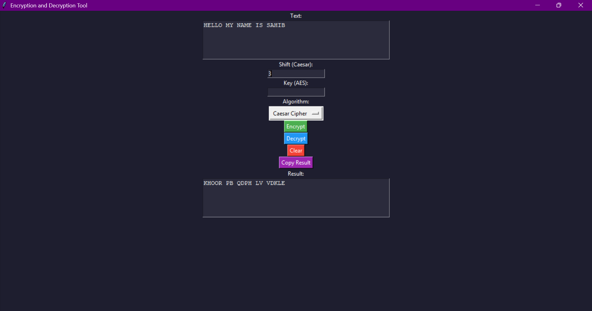
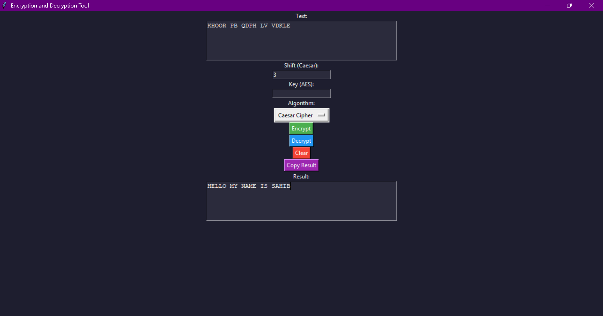
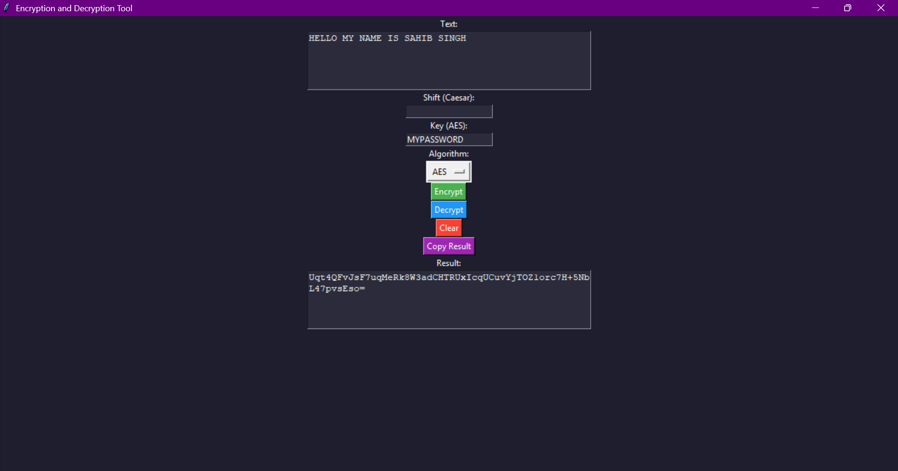
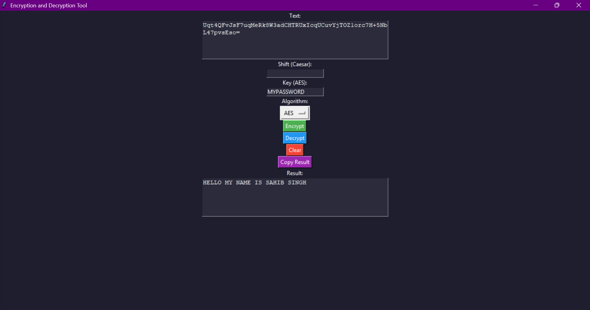

#  Encryption Tool

A GUI-based encryption and decryption tool built using Python.  
This project implements both classical and modern cryptographic techniques.

---

##  Features
- Caesar Cipher encryption & decryption
- AES (Advanced Encryption Standard) encryption
- User-friendly GUI using Tkinter
- Secure key handling using SHA-256
- Error handling for invalid inputs

---

##  Tech Stack
- Python
- Tkinter (GUI)
- PyCryptodome (AES Encryption)
- hashlib (Key normalization)

---

##  How to Run
1. Install dependencies:
   pip install -r requirements.txt

2. Run the application:
   python encryption_tool.py

---

##  Project Objective
To provide a simple and user-friendly tool for encrypting and decrypting text using both basic and advanced cryptographic methods.

---

##  Concepts Used
- Caesar Cipher (Classical Cryptography)
- AES Encryption (Modern Cryptography)
- SHA-256 Hashing

- ## 📸 Screenshots

### Caesar Cipher

### AES Encryption

